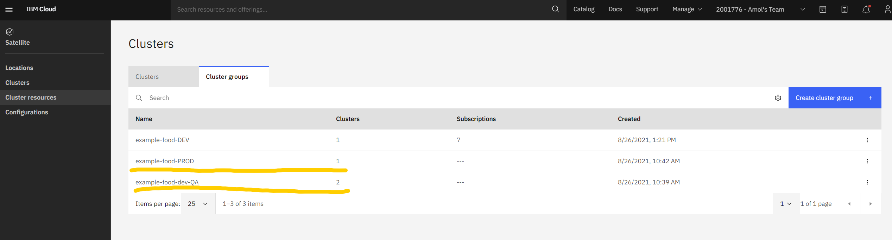

# 2. Verify Cluster Groups

Verify that you have 2 cluster groups

Using the left navigation bar in IBM Cloud, select **Satellite &gt;** **Clusters.** Then navigate to the **Cluster Groups** on that page

You should see 2 cluster groups. The **example-food-dev-QA** should have 2 clusters and **example-food-PROD** should have 1 cluster. You will not modify anything here.

