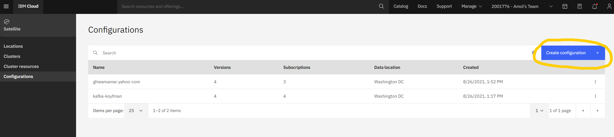
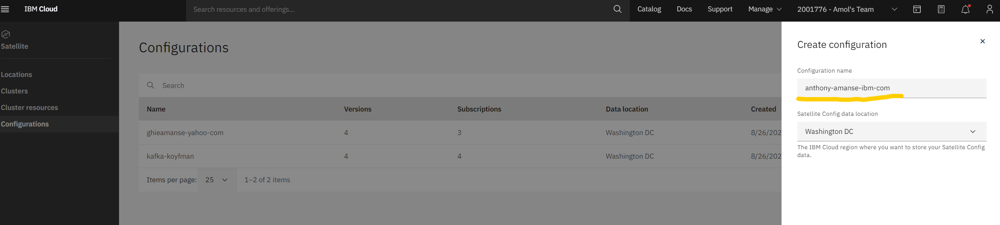

# 3. Create Configuration

1. Create a Configuration for yourself. Navigate to the **Configurations** section on the left tab and click on **Create configuration**. ****Name it something unique to yours \(like your IBM id\).


Make sure not to modify or use other people's Configuration.


