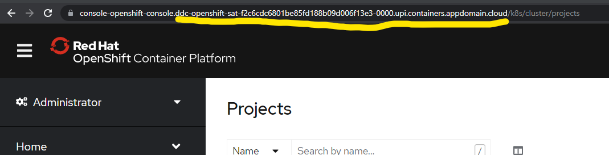

# 6. Expose application

To expose the application, you will use the OpenShift CLI. You will create routes for each of the 3 clusters you have.

* On the left navigation bar, go to **Satellite &gt; Clusters.** You will see the clusters assigned to you. Select the **dev** cluster and click on **Manage Cluster.** Then you'll see the **OpenShift web console** button. That will take you to the OpenShift console of that cluster.


* On the OpenShift console, you'll find the login command for your OpenShift CLI at the top right corner. Hover over it and follow the instructions. You should see a **Display Token** button.


* You can now log in using the `oc login --token=...` command given to you.
* Then, you will modify **route-dev/routes.yaml** file. Change the instances of `YOUR_NAMESPACE` to the namespace assigned to you. 

```text
sed -i 's/YOUR_NAMESPACE/<the-namespace-assigned-to-you>/g' <folder>/routes.yaml

# EXAMPLE
# sed -i 's/YOUR_NAMESPACE/ghieamanse-yahoo-com-project/g' route-dev/routes.yaml

```


There are multiple routes so make sure you change all of them.


```text
# EXAMPLE
...
spec:
  host: example-food-ghieamanse-yahoo-com-project.CLUSTER_DOMAIN_NAME
  port:
    targetPort: 8090
...
```

* Then back in the OpenShift console, take note of the domain name in the address/URL bar of your browser. _\(Not including the subdomain\)_ Then in the same **routes.yaml** file, change the instances of `CLUSTER_DOMAIN_NAME` to your domain name.


Ther are multiple routes so make sure you change all of them.




* Example domain name above is `ddc-openshift-sat-f2c6cdc6801be85fd188b09d006f13e3-0000.upi.containers.appdomain.cloud`

```text
sed -i 's/CLUSTER_DOMAIN_NAME/<the-clusters-domain-name>/g' <folder>/routes.yaml

# EXAMPLE
# sed -i 's/CLUSTER_DOMAIN_NAME/ddc-openshift-sat-f2c6cdc6801be85fd188b09d006f13e3-0000.upi.containers.appdomain.cloud/g' route-dev/routes.yaml
```

```text
# routes-dev/routes.yaml file EXAMPLE
...
spec:
  host: example-food-ghieamanse-yahoo-com-project.ddc-openshift-sat-f2c6cdc6801be85fd188b09d006f13e3-0000.upi.containers.appdomain.cloud
  port:
    targetPort: 8090
...
```

* You can now create the route using the OpenShift CLI

```text
oc apply -f routes-dev/routes.yaml
```

* You can visit the application you deployed by going to the frontend's URL. You can get them again using the command below

```text
oc get route example-food -o jsonpath='{.spec.host}'

## example output
example-food-ghieamanse-yahoo-com-project.***.cloud
```

Make sure you use `http://` since the app is not using TLS. The app would look like below:


* **Then you will repeat the steps above for the other 2 clusters you have**. Duplicate files have been provided for you in the **routes-qa** and **routes-prod** folder. The `CLUSTER_DOMAIN_NAME` should be different from each cluster.

